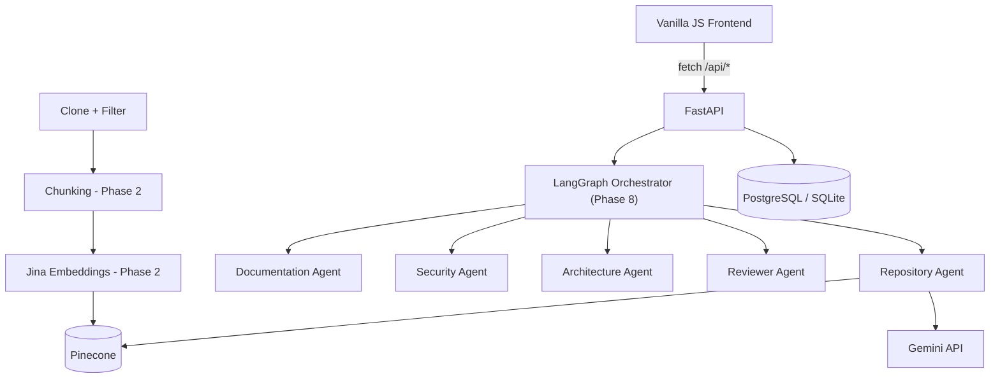

# System Architecture — AI Developer Assistant

## 1. Overview

A repository analysis platform: import a GitHub repo, then chat with it, generate docs, scan for security issues, review code quality, and visualize architecture. Runs as a single FastAPI process that serves both the REST API (`/api/*`) and the static frontend (`/`) on one port.

## 2. Component diagram



## 3. Why single-port serving

`app/main.py` mounts the frontend as static files **after** registering all `/api/*` routes:
```python
app.include_router(repository_router, prefix="/api")
app.include_router(repositories_router, prefix="/api")
...
app.mount("/", StaticFiles(directory=str(FRONTEND_DIR), html=True), name="frontend")
```
Order matters — the static mount is a catch-all, so it must be registered last or it would shadow the API routes. This removes CORS friction entirely in production (same origin) and means the whole app deploys as one process.

## 4. Layers

- **Frontend** — vanilla HTML/CSS/JS, no build step. Three-layer split: `api/` (data), `templates/` (reusable UI pieces), `pages/` (route composition). See `frontend/TEMPLATES.md`.
- **API layer** — FastAPI, async throughout, thin route handlers.
- **Service layer** — framework-agnostic business logic (`github_service.py`, `file_filter_service.py`) — testable without FastAPI.
- **Data layer** — async SQLAlchemy 2.0, SQLite (dev) / Postgres (prod) via one `DATABASE_URL`.
- **RAG + LLM layers** — planned Phase 2+ (Jina embeddings, Pinecone, Gemini, LangGraph).

## 5. Key design decisions

- **GitHub URL validated by parsed hostname**, not regex — closes SSRF bypass patterns like `github.com.evil.com`.
- **Shallow clone (`depth=1`)** — only current file state needed, faster and smaller.
- **`repository.status` is a plain string**, not a native Postgres ENUM — easier to extend later.
- **Auth is stubbed** with a single demo user — schema already supports multi-tenancy for when real auth is added.
- **`Base.metadata.create_all()`** instead of Alembic for now — schema still evolving phase to phase; switch before first real deploy.

## 6. Folder structure

```
ai-dev-assistant/
├── backend/app/
│   ├── main.py            FastAPI app, lifespan, static mount
│   ├── core/               settings, rate limiter
│   ├── database/           async engine + session
│   ├── models/              7 ORM tables
│   ├── schemas/             Pydantic I/O shapes
│   ├── services/            business logic (framework-agnostic)
│   └── api/routes/          thin route handlers
├── frontend/
│   ├── index.html
│   ├── css/style.css
│   └── js/{api,templates,pages}/
└── docs/
```
